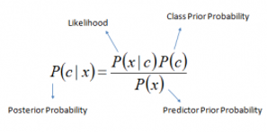

## 1.朴素贝叶斯为什么是“朴素”的？（naïve beyes）   
朴素贝叶斯算法是基于贝叶斯定理与特征条件独立假设的分类方法，朴素贝叶斯之所以有朴素两个字，就是因为它把问题简化了，假设所有特征参数均相互独立。
比如，如果水果呈红色，圆形，直径约3英寸，则可认为它是苹果。 即使这些特征依赖于彼此或者依赖于其他特征的存在，
所有这些特征独立地贡献了这种水果是苹果的可能性，这就是为什么它被称为“朴素”的原因。朴素贝叶斯算法很容易构建且对大型数据库非常有用，
多用于多元类别下的文本分类问题。    
它也是基于贝叶斯定律的，如下图，一般的贝叶斯估计就是基于条件概率。    
    

&nbsp;&nbsp;&nbsp;&nbsp;&nbsp;基于朴素贝叶斯公式，比较出后验概率的最大值来进行分类，后验概率的计算是由先验概率与类条件概率的乘积得出，
先验概率和类条件概率要通过训练数据集得出，即为朴素贝叶斯分类模型，将其保存为中间结果，测试文档进行分类时调用这个中间结果得出后验概率。
   
&nbsp;&nbsp;&nbsp;&nbsp;&nbsp;分类是把一个事物分到某个类别中。一个事物具有很多属性，把它的众多属性看作一个向量，即x=(x1,x2,x3,…,xn)，用x这个向量来代表这个事物，
x的集合记为X，称为属性集。类别也有很多种，用集合C={c1,c2,…cm}表示。一般X和C的关系是不确定的，可以将X和C看作是随机变量，
P(C|X)称为C的后验概率，与之相对的，P(C)称为C的先验概率。    
     
&nbsp;&nbsp;&nbsp;&nbsp;&nbsp;根据贝叶斯公式，后验概率P(C|X)=P(X|C)P(C)/P(X)，但在比较不同C值的后验概率时，分母P(X)总是常数，
忽略掉，后验概率P(C|X)=P(X|C)P(C)，先验概率P(C)可以通过计算训练集中属于每一个类的训练样本所占的比例，对类条件概率P(X|C)的估计，
我们只谈论朴素贝叶斯分类器方法，因为朴素贝叶斯假设事物属性之间相互条件独立，P(X|C)=∏P(xi|ci)。      
**[scikit-learn 朴素贝叶斯类库使用小结-刘建平 ](https://www.cnblogs.com/pinard/p/6074222.html)** 写的很好，过程推导很详细    
参考博文 
[利用朴素贝叶斯进行新闻文本分类](https://blog.csdn.net/zheng_weibin/article/details/82773323)     
[【NLP实践-Task4 传统机器学习】朴素贝叶斯 & SVM & LDA文本分类](https://blog.csdn.net/yyy430/article/details/88346920)    
## 2.朴素贝叶斯模型应用场景    
应用场景：     
（1）实时预测：朴素贝叶斯算法简单便捷。 因此，它可以用于实时进行预测。    
（2）多分类预测：适用于目标变量为多类别的任务，这里我们可以预测多类目标变量的概率。    
（3）文本分类/垃圾邮件过滤/情感分析：主要用于文本分类的朴素贝叶斯分类器（由于多类问题和独立规则更好的结果）与其他算法相比具有更高的成功率。 
因此，它被广泛用于垃圾邮件过滤（识别垃圾邮件）和情感分析（在社交媒体分析中，识别积极和消极的客户情绪）     
（3）推荐系统：朴素贝叶斯分类器和协作过滤一起构建推荐系统，该系统使用机器学习和数据挖掘技术来过滤看不见的信息并预测用户是否会喜欢给定的资源，
简单的例子就是淘宝上的商品推荐。      
 
## 3.朴素贝叶斯模型优缺点   

朴素贝叶斯的主要**优点**有：    
1）朴素贝叶斯模型发源于古典数学理论，有稳定的分类效率。     
2）对小规模的数据表现很好，能个处理多分类任务，适合增量式训练，尤其是数据量超出内存时，我们可以一批批的去增量训练。    
3）对缺失数据不太敏感，算法也比较简单，常用于文本分类。   
   
朴素贝叶斯的主要**缺点**有：　　　    
1） 理论上，朴素贝叶斯模型与其他分类方法相比具有最小的误差率。但是实际上并非总是如此，这是因为朴素贝叶斯模型给定输出类别的情况下,假设属性之间相互独立，
这个假设在实际应用中往往是不成立的，在属性个数比较多或者属性之间相关性较大时，分类效果不好。而在属性相关性较小时，朴素贝叶斯性能最为良好。
对于这一点，有半朴素贝叶斯之类的算法通过考虑部分关联性适度改进。    
2）需要知道先验概率，且先验概率很多时候取决于假设，假设的模型可以有很多种，因此在某些时候会由于假设的先验模型的原因导致预测效果不佳。    
3）由于我们是通过先验和数据来决定后验的概率从而决定分类，所以分类决策存在一定的错误率。     
4）对输入数据的表达形式很敏感。    
   
## 4.朴素贝叶斯sklearn参数学习   
在python的scikit learn库中有朴素贝叶斯的程序包，它包括三种类型：   
（1）高斯Gaussian：用于分类，它假定特征遵循正态分布。   
（2）多项Multinomial：用于离散计数。例如，假设我们有文本分类问题。在这里，我们可以考虑更进一步的伯努利试验，而不是“在文档中出现的词”，而是“计算文档中出现词的频率”，
您可以将其视为“在n次试验中观察结果数x_i出现的次数”。 
[scikit-learn 朴素贝叶斯类库使用小结-刘建平](https://www.cnblogs.com/pinard/p/6074222.html)       
[python机器学习库sklearn——朴素贝叶斯分类器](https://blog.csdn.net/luanpeng825485697/article/details/78967139)    
## 5.利用朴素贝叶斯模型结合tf-idf算法进行文本分类    
```
#先实例化模型，然后调用methods，如调用fit、predict

nb=MultinomialNB(alpha=0.01)#实例化模型 alpha: Additive (Laplace/Lidstone) smoothing parameter (0 for no smoothing).
nb.fit(x_train,y_train)#训练模型	Fit Naive Bayes classifier according to X, y
y_pred=nb.predict(x_test)#预测测试集X; Perform classification(分类) on an array of test vectors X.
print(classification_report(y_test,y_pred))#打印输出评分

precision    recall  f1-score   support

           0       1.00      0.99      1.00       214
           1       0.98      0.99      0.99       203
           2       0.91      0.89      0.90       196
           3       0.91      0.93      0.92       196
           4       0.98      0.97      0.97       193
           5       1.00      0.99      0.99       195
           6       0.97      0.96      0.96       226
           7       0.96      0.95      0.96       196
           8       0.99      0.98      0.99       192
           9       0.93      0.98      0.96       189

   micro avg       0.96      0.96      0.96      2000
   macro avg       0.96      0.96      0.96      2000
weighted avg       0.96      0.96      0.96      2000

nb.score(x_test, y_test)
#0.96350000000000002
```     
[git地址](https://github.com/Bonnie523/NLP-learning/blob/master/task05/贝叶斯文本分类-cnews.ipynb)
