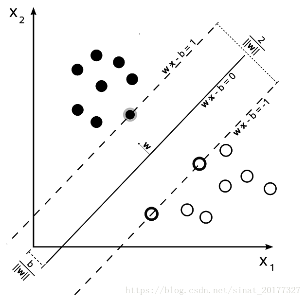
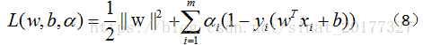
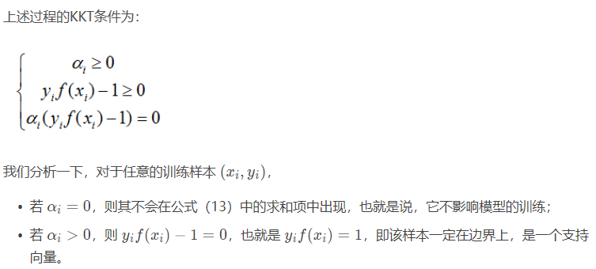
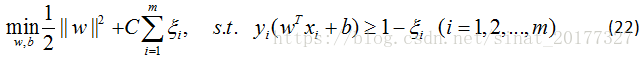

## 1. SVM的原理  
&emsp;&emsp;支持向量机（support vector machines）是一种二分类模型，它的目的是寻找一个超平面来对样本进行分割，分割的原则是间隔最大化，
最终转化为一个凸二次规划问题来求解。由简至繁的模型包括：   
* 当训练样本线性可分时，通过硬间隔最大化，学习一个线性可分支持向量机；  
* 当训练样本近似线性可分时，通过软间隔最大化，学习一个线性支持向量机；  
* 当训练样本线性不可分时，通过核技巧和软间隔最大化，学习一个非线性支持向量机；  
### 1.1、线性可分支持向量机  
1、间隔最大化和支持向量   
如果一个线性函数能够将样本分开，称这些数据样本是线性可分的。那么什么是线性函数呢？
其实很简单，在二维空间中就是一条直线，在三维空间中就是一个平面，以此类推，如果不考虑空间维数，这样的线性函数统称为超平面。
我们看一个简单的二维空间的例子，O代表正类，X代表负类，样本是线性可分的，但是很显然不只有这一条直线可以将样本分开，
而是有无数条，我们所说的线性可分支持向量机就对应着能将数据正确划分并且间隔最大的直线。   
   
线性支持向量机的基本型：  
   
2、对偶问题   
公式（7）本身是一个凸二次规划问题，可以使用现有的优化计算包来计算，但我们选择更为高效的方法。   
使用`**拉格朗日乘子法**`可以得到其“对偶问题”。
这是拉格朗日对偶性，即，通过给每一个约束条件加上一个拉格朗日乘子。然后定义出拉格朗日函数，通过拉格朗日函数将约束条件融合进目标函数中。
目的是，`只需要通过一个目标函数包含约束条件，便可以清楚解释问题`---[参考](https://blog.csdn.net/sinat_20177327/article/details/79729551)--- 对公式（7）使用拉格朗日乘子法得到其对偶问题，该问题的拉格朗日函数可以写为：  
    
KKT条件是一个线性规划问题能有最优解的充分和必要条件。对上述过程（推导省略）需要KKT条件，即要求：  
    
### 1.2、线性支持向量机（软间隔支持向量机）与松弛变量   
在前面的讨论中，我们假设训练样本在样本空间或者特征空间中是线性可分的，但在现实任务中往往很难确定合适的核函数使训练集在特征空间中线性可分，
退一步说，即使瞧好找到了这样的核函数使得样本在特征空间中线性可分，也很难判断是不是由于过拟合造成。   
    
[持向量机原理(二) 线性支持向量机的软间隔最大化模型-刘建平](http://www.cnblogs.com/pinard/p/6100722.html)--过程推导很详细。     
### 1.3、非线性支持向量机和核函数   
对于非线性问题，线性可分支持向量机并不能有效解决，要使用非线性模型才能很好地分类。先看一个例子，
如下图，很显然使用直线并不能将两类样本分开，但是可以使用一条椭圆曲线（非线性模型）将它们分开。非线性问题往往不好求解，
所以希望能用解线性分类问题的方法求解，因此可以采用非线性变换，将非线性问题变换成线性问题。   
[支持向量机原理(三)线性不可分支持向量机与核函数-刘建平](http://www.cnblogs.com/pinard/p/6103615.html)--过程推导很详细。   
[总体框架结构参考](https://blog.csdn.net/sinat_20177327/article/details/79729551 )    
## 2. SVM应用场景   
SVM的主要思想可以概括为如下两点：   
（1）它是针对线性可分的情况进行分析的。对于线性不可分的情况，通过使用非线性映射算法将低维输入空间线性不可分的样本转化为高维特征空间，使其线性可分，从而使得在高维特征空间中采用线性算法对样本的非线性特征进行线性分析成为可能。    
（2）它基于结构风险最小化理论，在特征空间中构建最优分类面，使得学习器能够得到全局最优化，并且使整个样本空间的期望风险以某个概率满足一定上界。    
&emsp;&emsp;从上面的两点基本思想来看，SVM没有使用传统的推导过程，简化了通常的分类和回归等问题；少数的支持向量确定了SVM 的最终决策函数，计算的复杂性取决于支持向量，而不是整个样本空间，这就可以避免“维数灾难”。少数支持向量决定了最终结果，这不但可以帮助我们抓住关键样本，而且注定了该方法不但算法简单，而且具有较好的“鲁棒”性。    
### 2.1人脸检测、验证和识别    
　　Osuna最早将SVM应用于人脸检测，取得了较好的效果。其方法是直接训练非线性SVM分类器完成人脸与非人脸的分类。由于SVM的训练需要大量的存储空间，并且非线性SVM分类器需要较多的支持向量，速度很慢，因此，他提出了一种层次性结构的SVM分类器，它由一个线性SVM的组合和一个非线性SVM组成。检测时，由前者快速排除掉图像中绝大部分背景窗日，而后者只需对少量的候选区域做出确认。    
### 2.2说话人/语音识别    
　　&emsp;&emsp;说话人识别属于连续输入信号的分类问题，SVM是一个很好的分类器，但不适合连续输入样本。为此，引入了隐式马尔可夫模型HMM，建立了SVM和HMM的混合模型。HMM适合处理连续信号，而SVM适合分类问题；HMM的结果反映了同类样本的相似度，而SVM的输出结果则体现了异类样本间的差异。为了方便与HMM组成混合模型，需要首先将SVM的输出形式改为概率输出。    
### 2.3文字/手写体识别    
　　贝尔实验室对美国邮政手写数字库进行的实验中，人工识别平均错误率为2.500，专门针对该特定问题设计的5层神经网络错误率为5.100（其中利用了大量先验知识），而用3种SVM方法（采用3种核函数）得到的错误率分别为2.000、2.1%和2.200，且SVM是直接采用16X 16的字符点阵作为输入的，表明了SVM的优越性能。    
### 2.4图像处理    
　　2.4.1图像过滤。一般的针对互联网色情图像的过滤软件主要采用网址库的形式封锁色情网址或采用人工智能方法对接收到的中、英文信息进行分析甄别。学者们提出了一种多层次特定类型图像过滤法，即综合肤色模型检验、支持向量机分类和最近邻方法校验的多层系图像处理框架，此方法能够达到85%以上的准确率。    
　　2.4.2视频字幕提取。视频字幕蕴含了丰富的语义，可用于对相应视频流进行高级语义标注。研究人员提出并实践了基于SVM的视频字幕自动定位和提取的方法，该方法首先将原始图像的帧分割为NXN的子块，提取每个子块的灰度特征，然后使用预先训练好的SVM分类机进行字幕子块和非字幕子块的分类，最后结合金字塔模型和后期处理，实现视频图像字幕区域的自动定位提取。    
　　2.4.3图像分类和检索。由于计算机自动抽取的图像特征和人所理解的语义间存在巨大差异，图像检索的结果难以令人满意。近年来出现了相关反馈方法，以SVM为分类器，在每次反馈中对用户标记的正例和反例样本进行学习，并根据学习所得的模型进行检索。相关研究人员使用了由9918幅图像组成的图像库进行了实验，结果表明，这种方法在训练样本有限的情况下具有良好的泛化功能。    
### 2.5其他方面的应用     
　　SVM除了在上述领域中得到了成功的应用外，在其他领域，如汽轮发电机组的故障诊断，金融工程，生物医药信号处理，生物信息，自适应信号处理，手写体相似字识别，岩爆预测的支持向量机，缺陷识别等领域都有成功的应用。   
## 3. SVM优缺点   
SVM算法是一个很优秀的算法，在集成学习和神经网络之类的算法没有表现出优越性能前，SVM基本占据了分类模型的统治地位。目前则是在大数据时代的大样本背景下,SVM由于其在大样本时超级大的计算量，热度有所下降，但是仍然是一个常用的机器学习算法。   
**SVM算法的主要优点有：**   
　　　　1) 解决高维特征的分类问题和回归问题很有效,在特征维度大于样本数时依然有很好的效果。   
　　　　2) 仅仅使用一部分支持向量来做超平面的决策，无需依赖全部数据。   
　　　　3) 有大量的核函数可以使用，从而可以很灵活的来解决各种非线性的分类回归问题。   
　　　　4)样本量不是海量数据的时候，分类准确率高，泛化能力强。   
**SVM算法的主要缺点有：**   
　　　　1) 如果特征维度远远大于样本数，则SVM表现一般。  
　　　　2) SVM在样本量非常大，核函数映射维度非常高时，计算量过大，不太适合使用。   
　　　　3）非线性问题的核函数的选择没有通用标准，难以选择一个合适的核函数。   
　　　　4）SVM对缺失数据敏感。   
## 4、代码实现（参考上节贝叶斯）  
将最后贝叶斯模型部分替换为：   
```
from sklearn.svm import SVC   
svclf = SVC(kernel = 'linear') 
svclf.fit(x_train,y_train)  
preds = svclf.predict(x_test);  
num = 0
preds = preds.tolist()
print(classification_report(y_test,preds))
```


