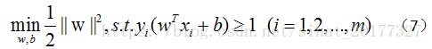

## 1. SVM的原理  
&emsp;&emsp;支持向量机（support vector machines）是一种二分类模型，它的目的是寻找一个超平面来对样本进行分割，分割的原则是间隔最大化，
最终转化为一个凸二次规划问题来求解。由简至繁的模型包括：   
* 当训练样本线性可分时，通过硬间隔最大化，学习一个线性可分支持向量机；  
* 当训练样本近似线性可分时，通过软间隔最大化，学习一个线性支持向量机；  
* 当训练样本线性不可分时，通过核技巧和软间隔最大化，学习一个非线性支持向量机；  
### 1.1、线性可分支持向量机  
1、间隔最大化和支持向量   
如果一个线性函数能够将样本分开，称这些数据样本是线性可分的。那么什么是线性函数呢？
其实很简单，在二维空间中就是一条直线，在三维空间中就是一个平面，以此类推，如果不考虑空间维数，这样的线性函数统称为超平面。
我们看一个简单的二维空间的例子，O代表正类，X代表负类，样本是线性可分的，但是很显然不只有这一条直线可以将样本分开，
而是有无数条，我们所说的线性可分支持向量机就对应着能将数据正确划分并且间隔最大的直线。   
   
线性支持向量机的基本型：  
   
2、对偶问题   
公式（7）本身是一个凸二次规划问题，可以使用现有的优化计算包来计算，但我们选择更为高效的方法。   
使用`**拉格朗日乘子法**`可以得到其“对偶问题”。
这是拉格朗日对偶性，即，通过给每一个约束条件加上一个拉格朗日乘子。然后定义出拉格朗日函数，通过拉格朗日函数将约束条件融合进目标函数中。
目的是，`只需要通过一个目标函数包含约束条件，便可以清楚解释问题`---[参考](https://blog.csdn.net/sinat_20177327/article/details/79729551)--- 对公式（7）使用拉格朗日乘子法得到其对偶问题，该问题的拉格朗日函数可以写为：  
    
KKT条件是一个线性规划问题能有最优解的充分和必要条件。对上述过程（推导省略）需要KKT条件，即要求：  
    
### 1.2、线性支持向量机（软间隔支持向量机）与松弛变量   
在前面的讨论中，我们假设训练样本在样本空间或者特征空间中是线性可分的，但在现实任务中往往很难确定合适的核函数使训练集在特征空间中线性可分，
退一步说，即使瞧好找到了这样的核函数使得样本在特征空间中线性可分，也很难判断是不是由于过拟合造成。   
    
[持向量机原理(二) 线性支持向量机的软间隔最大化模型-刘建平](http://www.cnblogs.com/pinard/p/6100722.html)--过程推导很详细。     
### 1.3、非线性支持向量机和核函数   
对于非线性问题，线性可分支持向量机并不能有效解决，要使用非线性模型才能很好地分类。先看一个例子，
如下图，很显然使用直线并不能将两类样本分开，但是可以使用一条椭圆曲线（非线性模型）将它们分开。非线性问题往往不好求解，
所以希望能用解线性分类问题的方法求解，因此可以采用非线性变换，将非线性问题变换成线性问题。   
[支持向量机原理(三)线性不可分支持向量机与核函数-刘建平](http://www.cnblogs.com/pinard/p/6103615.html)--过程推导很详细。   
[总体框架结构参考](https://blog.csdn.net/sinat_20177327/article/details/79729551 )

