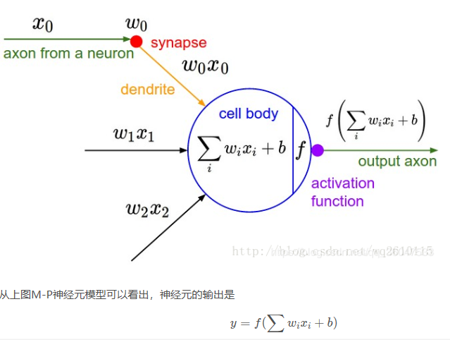
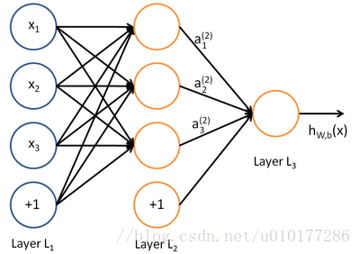
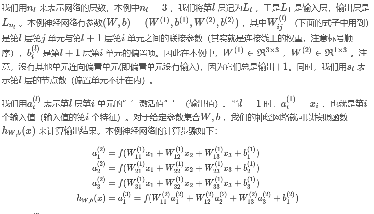

## 1.神经网络基本概念  
#### 1.1神经元   
  
#### 1.2神经网络   
  
其中一个神经元的输出是另一个神经元的输入，+1项表示的是偏置项（bias）。上图是含有一个隐含层的神经网络模型，
L1层称为输入层，L2层称为隐含层，L3层称为输出层。通常我们所说的N层神经网络并不包含输入层，如上图即两层的神经网络。  
    
[前馈神经网络=====>](http://deeplearning.stanford.edu/wiki/index.php/神经网络)
