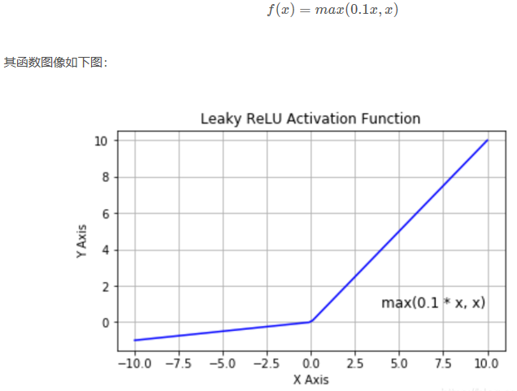

## 1. 神经网络基本概念  
#### 1.1 神经元   
   
f为激活函数，其用途为:     
&emsp;&emsp;如果不用激励函数（其实相当于激励函数是f(x) = x），在这种情况下你每一层节点的输入都是上层输出的线性函数，很容易验证，无论你神经网络有多少层，输出都是输入的线性组合，与没有隐藏层效果相当，这种情况就是最原始的感知机（Perceptron）了，那么网络的逼近能力就相当有限。正因为上面的原因，我们决定引入非线性函数作为激励函数，这样深层神经网络表达能力就更加强大（不再是输入的线性组合，而是几乎可以逼近任意函数）。   
 
#### 1.2 神经网络   
  
&emsp;&emsp;其中一个神经元的输出是另一个神经元的输入，+1项表示的是偏置项（bias）。上图是含有一个隐含层的神经网络模型，
L1层称为输入层，L2层称为隐含层，L3层称为输出层。通常我们所说的N层神经网络并不包含输入层，如上图即两层的神经网络。  
    
[前馈神经网络=====>](http://deeplearning.stanford.edu/wiki/index.php/神经网络)
## 2. 激活函数   
#### 2.1 Sigmoid函数   
   
Sigmoid 函数将实数值映射到0到1的范围内，越小的数越趋近于0，越大的数越趋近于1。Sigmoid函数是原来使用最多的激活函数，由于其能够很好的解释神经元的起火频率，0表示没起火，1表示全饱和（fully-saturated）。从上图可以看出x<-10或者x>10都不存在梯度。  
它的导数为：  
   
**缺点：**  
sigmoid函数曾经被使用的很多，不过近年来，用它的人越来越少了。主要是因为它固有的一些 缺点。   
* 缺点1：在深度神经网络中梯度反向传递时导致梯度爆炸和梯度消失，其中梯度爆炸发生的概率非常小，而梯度消失发生的概率比较大。如果我们初始化神经网络的权值为 
[0,1]之间的随机值，由反向传播算法的数学推导可知，梯度从后向前传播时，每传递一层梯度值都会减小为原来的0.25倍，如果神经网络隐层特别多，那么梯度在穿过多层后将变得非常小接近于0，即出现梯度消失现象；  
* 缺点2：Sigmoid 的 output 不是0均值（即zero-centered）。   
#### 2.2 tanh函数   
   
它解决了Sigmoid函数的不是zero-centered输出问题，然而，梯度消失（gradient vanishing）的问题和幂运算的问题仍然存在。   
#### 2.3 Relu函数   
   
&emsp;&emsp;ReLU函数其实就是一个取最大值函数，注意这并不是全区间可导的，但是我们可以取sub-gradient，如上图所示。ReLU虽然简单，但却是近几年的重要成果，有以下几大优点：   
1） 解决了gradient vanishing问题 (在正区间)   
2）计算速度非常快，只需要判断输入是否大于0   
3）收敛速度远快于sigmoid和tanh    
&emsp;&emsp;ReLU也有几个需要特别注意的问题：   
1）ReLU的输出不是zero-centered     
2）Dead ReLU Problem，指的是某些神经元可能永远不会被激活，导致相应的参数永远不能被更新。有两个主要原因可能导致这种情况产生: (1) 非常不幸的参数初始化，这种情况比较少见 (2) learning rate太高导致在训练过程中参数更新太大，不幸使网络进入这种状态。解决方法是可以采用Xavier初始化方法，以及避免将learning rate设置太大或使用adagrad等自动调节learning rate的算法。   
&emsp;&emsp;**尽管存在这两个问题，ReLU目前仍是最常用的activation function，在搭建人工神经网络的时候推荐优先尝试！**  
#### 2.4  Leaky ReLU函数（PReLU）   
为了解决Dead ReLU Problem，提出了将ReLU的前半段设为ax,a通常取0.01，其公式如下：       
   
理论上来讲，Leaky ReLU有ReLU的所有优点，外加不会有Dead ReLU问题，但是在实际操作当中，并没有完全证明Leaky ReLU总是好于ReLU。  
#### 2.5  maxout函数  
   
**应用中如何选择合适的激活函数？**
这个问题目前没有确定的方法，凭一些经验吧。   
&emsp;&emsp;1）深度学习往往需要大量时间来处理大量数据，模型的收敛速度是尤为重要的。所以，总体上来讲，训练深度学习网络尽量使用zero-centered数据 (可以经过数据预处理实现) 和zero-centered输出。所以要尽量选择输出具有zero-centered特点的激活函数以加快模型的收敛速度。   
&emsp;&emsp;2）如果使用 ReLU，那么一定要小心设置 learning rate，而且要注意不要让网络出现很多 “dead” 神经元，如果这个问题不好解决，那么可以试试 Leaky ReLU、PReLU 或者 Maxout.   
&emsp;&emsp;3）最好不要用 sigmoid，你可以试试 tanh，不过可以预期它的效果会比不上 ReLU 和 Maxout.   

[常用激活函数（激励函数）理解与总结](https://blog.csdn.net/tyhj_sf/article/details/79932893)  
[神经网络基础](https://blog.csdn.net/qq_36047533/article/details/88419931)

