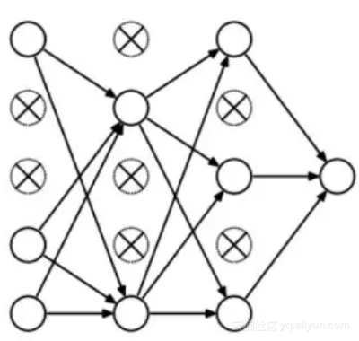
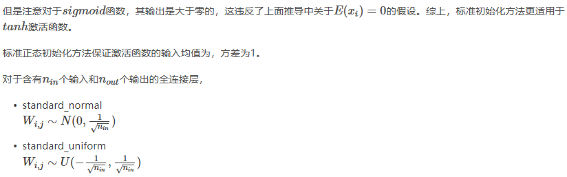

## 1. 神经网络基本概念  
#### 1.1 神经元   
   
f为激活函数，其用途为:     
&emsp;&emsp;如果不用激励函数（其实相当于激励函数是f(x) = x），在这种情况下你每一层节点的输入都是上层输出的线性函数，很容易验证，无论你神经网络有多少层，输出都是输入的线性组合，与没有隐藏层效果相当，这种情况就是最原始的感知机（Perceptron）了，那么网络的逼近能力就相当有限。正因为上面的原因，我们决定引入非线性函数作为激励函数，这样深层神经网络表达能力就更加强大（不再是输入的线性组合，而是几乎可以逼近任意函数）。   
 
#### 1.2 神经网络   
  
&emsp;&emsp;其中一个神经元的输出是另一个神经元的输入，+1项表示的是偏置项（bias）。上图是含有一个隐含层的神经网络模型，
L1层称为输入层，L2层称为隐含层，L3层称为输出层。通常我们所说的N层神经网络并不包含输入层，如上图即两层的神经网络。  
    
[前馈神经网络=====>](http://deeplearning.stanford.edu/wiki/index.php/神经网络)
## 2. 激活函数   
#### 2.1 Sigmoid函数   
   
Sigmoid 函数将实数值映射到0到1的范围内，越小的数越趋近于0，越大的数越趋近于1。Sigmoid函数是原来使用最多的激活函数，由于其能够很好的解释神经元的起火频率，0表示没起火，1表示全饱和（fully-saturated）。从上图可以看出x<-10或者x>10都不存在梯度。  
它的导数为：  
   
**缺点：**  
sigmoid函数曾经被使用的很多，不过近年来，用它的人越来越少了。主要是因为它固有的一些 缺点。   
* 缺点1：在深度神经网络中梯度反向传递时导致梯度爆炸和梯度消失，其中梯度爆炸发生的概率非常小，而梯度消失发生的概率比较大。如果我们初始化神经网络的权值为 
[0,1]之间的随机值，由反向传播算法的数学推导可知，梯度从后向前传播时，每传递一层梯度值都会减小为原来的0.25倍，如果神经网络隐层特别多，那么梯度在穿过多层后将变得非常小接近于0，即出现梯度消失现象；  
* 缺点2：Sigmoid 的 output 不是0均值（即zero-centered）。   
#### 2.2 tanh函数   
   
它解决了Sigmoid函数的不是zero-centered输出问题，然而，梯度消失（gradient vanishing）的问题和幂运算的问题仍然存在。   
#### 2.3 Relu函数   
   
&emsp;&emsp;ReLU函数其实就是一个取最大值函数，注意这并不是全区间可导的，但是我们可以取sub-gradient，如上图所示。ReLU虽然简单，但却是近几年的重要成果，有以下几大优点：   
1） 解决了gradient vanishing问题 (在正区间)   
2）计算速度非常快，只需要判断输入是否大于0   
3）收敛速度远快于sigmoid和tanh    
&emsp;&emsp;ReLU也有几个需要特别注意的问题：   
1）ReLU的输出不是zero-centered     
2）Dead ReLU Problem，指的是某些神经元可能永远不会被激活，导致相应的参数永远不能被更新。有两个主要原因可能导致这种情况产生: (1) 非常不幸的参数初始化，这种情况比较少见 (2) learning rate太高导致在训练过程中参数更新太大，不幸使网络进入这种状态。解决方法是可以采用Xavier初始化方法，以及避免将learning rate设置太大或使用adagrad等自动调节learning rate的算法。   
&emsp;&emsp;**尽管存在这两个问题，ReLU目前仍是最常用的activation function，在搭建人工神经网络的时候推荐优先尝试！**  
#### 2.4  Leaky ReLU函数（PReLU）   
为了解决Dead ReLU Problem，提出了将ReLU的前半段设为ax,a通常取0.01，其公式如下：       
   
理论上来讲，Leaky ReLU有ReLU的所有优点，外加不会有Dead ReLU问题，但是在实际操作当中，并没有完全证明Leaky ReLU总是好于ReLU。  
#### 2.5  maxout函数  
   
**应用中如何选择合适的激活函数？**
这个问题目前没有确定的方法，凭一些经验吧。   
&emsp;&emsp;1）深度学习往往需要大量时间来处理大量数据，模型的收敛速度是尤为重要的。所以，总体上来讲，训练深度学习网络尽量使用zero-centered数据 (可以经过数据预处理实现) 和zero-centered输出。所以要尽量选择输出具有zero-centered特点的激活函数以加快模型的收敛速度。   
&emsp;&emsp;2）如果使用 ReLU，那么一定要小心设置 learning rate，而且要注意不要让网络出现很多 “dead” 神经元，如果这个问题不好解决，那么可以试试 Leaky ReLU、PReLU 或者 Maxout.   
&emsp;&emsp;3）最好不要用 sigmoid，你可以试试 tanh，不过可以预期它的效果会比不上 ReLU 和 Maxout.   

[常用激活函数（激励函数）理解与总结](https://blog.csdn.net/tyhj_sf/article/details/79932893)  
[神经网络基础](https://blog.csdn.net/qq_36047533/article/details/88419931)
## 3. 深度学习中的正则化  
&emsp;&emsp;正则化技术是保证算法泛化能力的有效工具，因此算法正则化的研究成为机器学习中主要的研究主题。此外，正则化还是训练参数数量大于训练数据集的深度学习模型的关键步骤。正则化可以避免算法过拟合，过拟合通常发生在算法学习的输入数据无法反应真实的分布且存在一些噪声的情况。过去数年，研究者提出和开发了多种适合机器学习算法的正则化方法，如数据增强、L2 正则化（权重衰减）、L1 正则化、Dropout、Drop Connect、随机池化和早停等。   
#### 数据增强   
&emsp;数据增强是提升算法性能、满足深度学习模型对大量数据的需求的重要工具。数据增强通过向训练数据添加转换或扰动来人工增加训练数据集。数据增强技术如水平或垂直翻转图像、裁剪、色彩变换、扩展和旋转通常应用在视觉表象和图像分类中。  
#### L1和L2正则化   
&emsp;L1和L2是最常见的正则化类型。它们通过增加一个被称为正则项的额外项来更新成本函数：   
Cost function = Loss (say, binary cross entropy) + Regularization term   
由于增加了这个正则项，权重矩阵的值减小了，因为这里假定了具有较小权重矩阵的神经网络会导致更简单的模型。因此，它也会在相当程度上减少过拟合。   
    
#### Dropout  
dropout做什么呢？每次迭代，在神经网络模型中随机选择一些节点，将它们连同相应的输入和输出一起删掉，如下图：   
   
* 所以，每一轮迭代都有不同的节点集合，这也导致了不同的输出。它也可以被认为是一种机器学习中的集成技术（ensemble technique）。   
* 集成模型（ensemble models）通常比单一模型表现更好，因为捕获了更多的随机性。同样的，比起正常的神经网络模型，dropout也表现的更好。   
* 选择丢弃多少节点的概率是dropout函数的超参数。如上图所示，dropout可以被用在隐藏层以及输入层。   
#### Drop Connect  
&emsp;Drop Connect 是另一种减少算法过拟合的正则化策略，是 Dropout 的一般化。在 Drop Connect 的过程中需要将网络架构权重的一个随机选择子集设置为零，取代了在 Dropout 中对每个层随机选择激活函数的子集设置为零的做法。由于每个单元接收来自过去层单元的随机子集的输入，Drop Connect 和 Dropout 都可以获得有限的泛化性能。Drop Connect 和 Dropout 相似的地方在于它涉及在模型中引入稀疏性，不同之处在于它引入的是权重的稀疏性而不是层的输出向量的稀疏性。 
#### 早停法（stop early）   
&emsp;早停法可以限制模型最小化代价函数所需的训练迭代次数。早停法通常用于防止训练中过度表达的模型泛化性能差。如果迭代次数太少，算法容易欠拟合（方差较小，偏差较大），而迭代次数太多，算法容易过拟合（方差较大，偏差较小）。早停法通过确定迭代次数解决这个问题，不需要对特定值进行手动设置。   
## 4. 深度模型中的优化  
#### 4.1 参数初始化
&emsp;&emsp;为什么要参数初始化？      
&emsp;&emsp;为了让神经网络在训练过程中学习到有用的信息，需要参数更新时的梯度不为0。在一般的全连接网络中，参数更新的梯度和反向传播得到的状态梯度以及输入激活值有关。那么参数初始化应该满足以下两个条件：  
* 各层激活值不会出现饱和现象(对于sigmoid,tanh)；   
* 各层激活值不为0。  
全零初始化方法在前向传播过程中会使得隐层神经元的激活值均未0，在反向过程中根据BP公式，不同维度的参数会得到相同的更新。需要破坏这种“对称性”。
常见初始化方法之标准初始化：  
标准初始化方法通过对方差乘以一个系数确保每层神经元的输出具有相同的方差，提高训练收敛速度。
标准均匀初始化方法保证了激活函数的输入值的均值为0，方差为常量1/3，和网络的层数和神经元的数量无关。对于sigmoid激活函数来说，可以确保自变量处于有梯度的范围内。  
   
Xavier初始化(glorot初始化)和He初始化   
[深度学习之参数初始化策略](https://blog.csdn.net/u012151283/article/details/78230891/)  

#### 4.2 自适应学习率算法   
引入：   
&emsp;求解神经网络，也就是求解 y =f(wx + b) 中的w 和 b。   
&emsp;那么如何找到正确的权重值 w 和 b 呢？   
* 随机搜索。需要很多权重值，随机采样，然后把它们输入损失函数，再看它们效果如何。（stupid）  
* 梯度下降算法。首先，初始化 w 和 b， 然后，使用梯度下降算法，对 w 和 b 进行更新。   
梯度下降算法   
   
 形象化解释：  

&emsp;当你一个人走在山谷中，你可能不能直接看到一条直接的线路下到谷底，但可以凭借脚下的感觉，感知当地地形的几何形状，知道哪个方向地面的倾斜是朝向下山的方向。然后你朝那个方向走一步，你就下降了一点。然后再次用你的脚找出下山的方向。就这样一次一次的重复，最终你希望能够到达谷底。   

&emsp;斜率：至少在一维上，函数的导数就是斜率。   
&emsp;梯度：在多元情况下函数的导数，就叫做梯度。梯度就是偏导数组成的向量。    

&emsp;梯度有和自变量x一样的形状。梯度中的每个元素可以告诉我们，相关方向上，函数f的斜率。梯度指向函数增加最快的方向，相应地，负梯度方向就指向了函数下降最快的方向。     

梯度下降算法：   
&emsp;1. 我们对 w 和 b 进行随机初始化。     

&emsp;2. 我们计算损失和梯度，然后沿着梯度相反的方向，更新权重值。只需要记住：梯度指向损失函数增加最快的方向，所以负梯度方向指向损失函数减小最快的方向。所以，每次向负梯度的方向前进一小步，一直重复，最后网络将会收敛。   

&emsp;其中，步长是一个超参数，告诉我们每次在负梯度方向前进多少距离。这个步长也被叫做学习率。   

&emsp;基本的梯度下降方法，也就是每一步，我们都朝梯度方向迈进一小步。**优化方法，也就是高级一点的走法，它们运用一些更加新的法则。**你可以采取稍微好一点的步骤，在多步总整合梯度下降的步骤。这些优化方法，比这样普通梯度下降法更好用。  

&emsp;梯度下降的本质是，利用每一步的梯度，来决定下一步的方向。不同的优化方法有不同的更新策略，来决定究竟如何使用梯度信息。但背后都基于同样的基本算法，每一步都试着往下坡走。   

&emsp;&emsp;我们定义了一种损失误差，计算我们的分类器在训练样本中的每一步表现有多糟糕。我们设定，损失误差，是整个训练集误差的平均值。但实际中，N可能会非常非常大。例如，ImageNet数据集，N为130万。所以，如果使用全量N来计算loss，计算成本会非常高。因此，在实际操作中，我们往往会使用随机梯度下降，它并非计算整个训练集的误差和梯度值。而是在每一次迭代中，选取一小部分训练样本组成minibatch（小批量）。batchsize一般都取2的幂，如32，64，128等。然后我们利用minibatch来估算误差总和以及实际梯度。   [深度学习中的batch的大小对学习效果有何影响？](https://blog.csdn.net/u013250416/article/details/78843254)   

### 优化方法   
[深度学习最全优化方法总结比较（SGD，Adagrad，Adadelta，Adam，Adamax，Nadam](https://blog.csdn.net/u012759136/article/details/52302426)   
看完来不及码字了[^_^]
