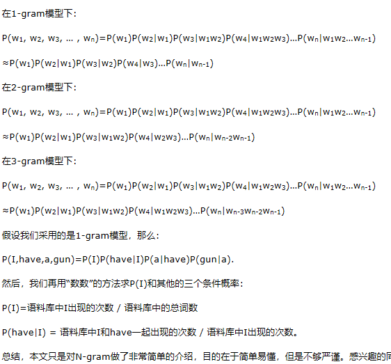

## 1.n-gram简单理解   
   
[N-gram语言模型简单介绍 ](https://www.cnblogs.com/wzm-xu/p/4229819.html)   
## 2. 基于N-gram模型的篇章单元分类器   
在斯坦福大学NLP领域大牛Dan Jurafsky 和 Chirs Manning的自然语言处理课程中，他们用训练集的9222个句子来统计的部分二元单词分布情况：   
表1 部分二元单词分布情况表   
    
第一行，第二列表示给定前一个词是 “i” 时，当前词为“want”的情况一共出现了827次。据此，我们便可以算得相应的频率分布表如下：   
表2 频率分布表   
   
&emsp;因为我们从表1中知道 “i” 一共出现了2533次，而其后出现 “want” 的情况一共有827次，所以P(want|i)=827/2533≈0.33。   
&emsp;假设我们现在有一个标记为背景（Background）语料库（由于现在只有两句，所以我们就不画上面的单词分布情况表以及频率分布表了）如下，
&emsp;其中"BG"是句首标记，"\BG"是句尾标记：   
"BG"yes no no no no yes"\BG"   
"BG"no no no yes yes yes no"\BG"   
&emsp;下面我们的任务是来评估如下这个句子属于“背景”这个篇章单元类别的概率：   
s="BG"yes no no yes"\BG"（先假设这句话的所属篇章单元类别为“背景”，这样我们可以提取第一个单词和最后一个单词的与“背景”相关的特征）   
&emsp;我们来演示利用trigram模型来计算概率的结果：   
P(yes|"BG") = 1/2   
P(no|"BG",yes) = 1   
P(no|yes,no) = 1/2  
P(yes|no,no) = 2/5   
P("\BG"|no,yes) = 1/2   
P(s) = 1/2*1*1/2*2/5*1/2 = 0.05，即句子s属于“背景”的概率为0.05。   
&emsp;**为了避免数据溢出、提高性能，通常会使用取log后使用加法运算替代乘法运算。**   
&emsp;log(p1*p2*p3*p4) = log(p1) + log(p2) + log(p3) + log(p4)    
&emsp;那么我们如何用N-gram来做篇章单元的分类器呢？其实很简单了，只要根据每个类别的语料库训练各自的语言模型，也就是上面的频率分布表，实质上就是每一个篇章单元的类别都有一个概率分布，当新来一个篇章单元的时候，只要根据各自的语言模型，计算出每个语言模型下这个篇章单元的发生概率，篇章单元在哪个模型的概率大，这篇文本就属于哪个类别了。     
&emsp;[链接：](https://www.imooc.com/article/20929)
