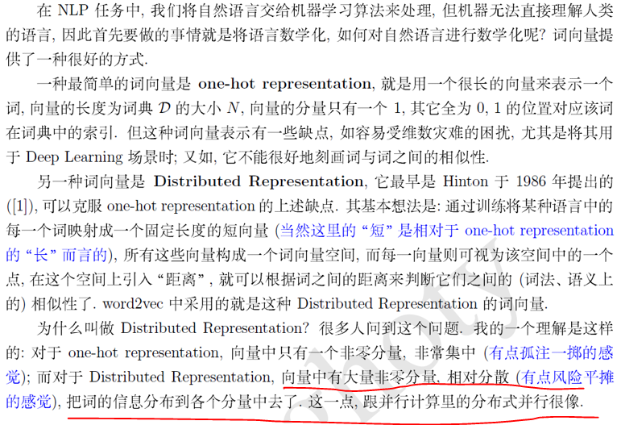

****
1. 文本表示：从one-hot到word2vec。   
1.1 词袋模型：离散、高维、稀疏。   
1.2 分布式表示：连续、低维、稠密。word2vec词向量原理并实践，用来表示文本。   
****    
### 1. 文本表示   
* 离散表示的代表就是词袋模型，one-hot（也叫独热编码）、TF-IDF、n-gram都可以看作是词袋模型。   
* 分布式表示也叫做词嵌入（word embedding），经典模型是word2vec，还包括后来的Glove、ELMO、GPT和BERT。   
  
词袋模型：离散、高维、稀疏。    
1. 离散：无法衡量词向量之间的关系。比如酒店、宾馆、旅社 三者都只在某一个固定的位置为 1 ，所以找不到三者的关系，各种度量(与或非、距离)都不合适，即太稀疏，很难捕捉到文本的含义。   
2. 高维：词表维度随着语料库增长膨胀，n-gram 序列随语料库膨胀更快。   
3. 稀疏： 数据都没有特征多，数据有 100 条，特征有 1000 个   
   
### 2. word2vec词向量原理并实践   
&emsp;&emsp;word2vec作为神经概率语言模型的输入，其本身其实是神经概率模型的副产品，是为了通过神经网络学习某个语言模型而产生的中间结果。
具体来说，“某个语言模型”指的是“CBOW”和“Skip-gram”。具体学习过程会用到两个降低复杂度的近似方法——Hierarchical Softmax或Negative Sampling。
两个模型乘以两种方法，一共有四种实现。   
1. CBOW：CBOW 是 Continuous Bag-of-Words Model 的缩写，是一种根据上下文的词语预测当前词语的出现概率的模型。
2. Skip-gram：Skip-gram只是逆转了CBOW的因果关系而已，即已知当前词语，预测上下文。     

[基于 Hierarchical Softmax 的模型](https://blog.csdn.net/itplus/article/details/37969817)   
&emsp;*[文章介绍]word2vec 是 Google 于 2013 年开源推出的一个用于获取 word vector 的工具包，它简单、高效，因此引起了很多人的关注。由于 word2vec 的作者 Tomas Mikolov 在两篇相关的论文 [3,4] 中并没有谈及太多算法细节，因而在一定程度上增加了这个工具包的神秘感。一些按捺不住的人于是选择了通过解剖源代码的方式来一窥究竟，出于好奇，我也成为了他们中的一员。读完代码后，觉得收获颇多，整理成文，给有需要的朋友参考。*     
   
[word2vec原理(二) 基于Hierarchical Softmax的模型-刘建平](http://www.cnblogs.com/pinard/p/7243513.html#!comments)   
&emsp;写的很详细，特别是需要看评论，会解释你很多困惑   
&emsp;怎么说呢，文章从昨天开始，认真看完了，整体了解，感知。贴了一些好的评论在Word2vec.md里    

**官方API介绍如下：**  
```
class gensim.models.word2vec.Word2Vec(sentences=None, corpus_file=None, size=100, alpha=0.025, window=5, min_count=5, max_vocab_size=None, sample=0.001, seed=1, workers=3, min_alpha=0.0001, sg=0, hs=0, negative=5, ns_exponent=0.75, cbow_mean=1, hashfxn=<built-in function hash>, iter=5, null_word=0, trim_rule=None, sorted_vocab=1, batch_words=10000, compute_loss=False, callbacks=(), max_final_vocab=None)
```
主要参数介绍如下：   
1. sentences：我们要分析的语料，可以是一个列表，或者从文件中遍历读出（word2vec.LineSentence(filename) ）。   
2. size：词向量的维度，默认值是100。这个维度的取值一般与我们的语料的大小相关，如果是不大的语料，比如小于100M的文本语料，则使用默认值一般就可以了。如果是超大的语料，建议增大维度。    
3. window：即词向量上下文最大距离，window越大，则和某一词较远的词也会产生上下文关系。默认值为5，在实际使用中，可以根据实际的需求来动态调整这个window的大小。如果是小语料则这个值可以设的更小。对于一般的语料这个值推荐在[5；10]之间。    
4. sg：即我们的word2vec两个模型的选择了。如果是0， 则是CBOW模型；是1则是Skip-Gram模型；默认是0即CBOW模型。    
5. hs：即我们的word2vec两个解法的选择了。如果是0， 则是Negative Sampling；是1的话并且负采样个数negative大于0， 则是Hierarchical Softmax。默认是0即Negative Sampling。    
6. negative：即使用Negative Sampling时负采样的个数，默认是5。推荐在[3,10]之间。这个参数在我们的算法原理篇中标记为neg。   
7. cbow_mean：仅用于CBOW在做投影的时候，为0，则算法中的xw为上下文的词向量之和，为1则为上下文的词向量的平均值。在我们的原理篇中，是按照词向量的平均值来描述的。个人比较喜欢用平均值来表示xw,默认值也是1,不推荐修改默认值。   
8. min_count：需要计算词向量的最小词频。这个值可以去掉一些很生僻的低频词，默认是5。如果是小语料，可以调低这个值。   
9. iter：随机梯度下降法中迭代的最大次数，默认是5。对于大语料，可以增大这个值。   
10. alpha：在随机梯度下降法中迭代的初始步长。算法原理篇中标记为η，默认是0.025。   
11. min_alpha: 由于算法支持在迭代的过程中逐渐减小步长，min_alpha给出了最小的迭代步。   
