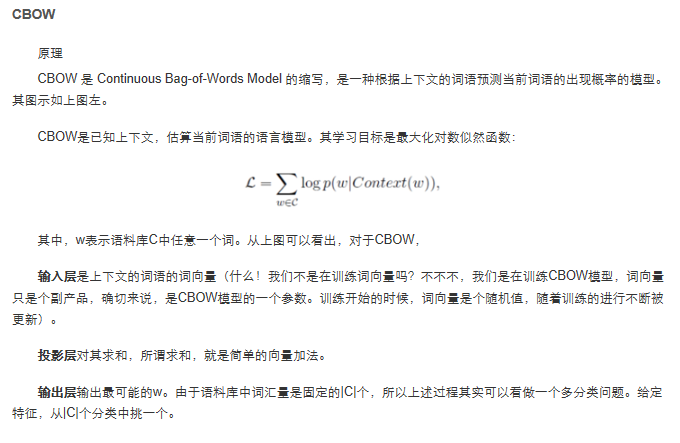

## 1. word2vec
&emsp;word2vec作为神经概率语言模型的输入，其本身其实是神经概率模型的副产品，是为了通过神经网络学习某个语言模型而产生的中间结果。
具体来说，“某个语言模型”指的是“CBOW”和“Skip-gram”。具体学习过程会用到两个降低复杂度的近似方法——Hierarchical Softmax或Negative Sampling。
两个模型乘以两种方法，一共有四种实现。这些内容就是本文理论部分要详细阐明的全部了。   
   
[word2vec原理推导与代码分析](http://www.hankcs.com/nlp/word2vec.html#h2-0)    
******    
来自刘建平博客评论---   
&emsp;2\\\您好！skip-gram是输入target，预测context，那请问它的输入是什么形式？您说输入层对应的是一个神经元？那是target作为1X1矩阵输入？毕竟在我的理解中输入层神经元节点数对应着输入向量的维度。  
&emsp;#8楼[楼主] 2018-07-01 22:27 刘建平Pinard    
你好，输入就是一个词向量，输出是若干词向量。如果词向量维度为5， 上下文一共8个词，那么输入就是一个词，向量维度为5， 输出就是8个词，每个词的向量维度为5.   
&emsp;word2vec里的节点定义和DNN的还是稍有不同，它没有完全按照DNN的模型来建立神经元，即你认为的可能输入是5个神经元。具体你可以看word2vec的代码就知道了，代码我在后面几篇有链接。   
******   
&emsp;1  你好，cbow和skip-gram 输入的词向量是One hot representation表示的维度很大的词向量，然后输出是像Dristributed representation表示的维度较短的词向量？是这样理解吗？     
&emsp;#13楼[楼主] 2018-08-03 13:18 刘建平Pinard    
你好，不是的。  
cbow和skip-gram **输 入的词向量是随机初始化的维度较短的词向量**，优化后，会成为最终的维度较短的词向量。也就是初始化和最后的结果词向量的维度一样。    
*******     
&emsp;3  问题1：如果输入的词向量是随机初始化的话，那么是对整个词典的词向量进行随机初始化，然后进行训练迭代，使得任一词作为输入和输出时词向量一致时训练结束，我这样理解对吗？   
&emsp;问题3：有些课程和博客说输入词向量是one-hot向量，实际word2vec是用那种向量作输入呢？    
&emsp;#29楼[楼主] 2018-09-17 11:00 刘建平Pinard     
1. 是的，整个语料库的词向量都做随机初始化。不过迭代结束不需要严格达到任一词作为输入和输出时词向量一致，而是满足改变的程度小于某一个极小的范围即可认为收敛。或者说新的词向量和老的词向量的欧式距离小于一定程度即可认为收敛。   
3.**word2vec不使用onehot向量，它的向量维度需要自己指定，比onehot的维度会小得多。**   
-----
&emsp;4- @ 刘建平Pinard
您好，博主。麻烦问下“最早的词向量神经网络是onehot的，后面慢慢也开始有低于onehot维度的词向量训练出现。不过这个小一些的维度也是自己定义的，由于自己定义，所以词向量就要随机初始化。”也就说现在的词向量神经网络多数不使用onehot的词向量作为网络的输入，更多的是采用随机化一个随机初始化的维度较短的词向量？这样做的原因是onehot的词向量维度太大，作为网络输入太复杂？但是随机初始化的词向量相比onehot词向量输入，是不是收敛性会差一些？        
&emsp;#40楼[楼主] 2019-01-15 10:58 刘建平Pinard   
你好！   
”也就说现在的词向量神经网络多数不使用onehot的词向量作为网络的输入，更多的是采用随机化一个随机初始化的维度较短的词向量？“---->这个只说了一半，应该是随机化一个随机初始化的维度较短的词向量，然后通过训练迭代优化这个词向量。   

“这样做的原因是onehot的词向量维度太大，作为网络输入太复杂？”--->是的，计算量大，性能不好。   

“但是随机初始化的词向量相比onehot词向量输入，是不是收敛性会差一些？”--->如果不通过训练优化词向量，随机初始化的肯定会差的，但是目前通过训练优化词向量是普遍的做法，因此不会出现收敛性差的问题。  
*****     
&emsp;感谢博主的回复。看过博主回复后又找了些资料看，感觉有些明白。两个问题其实最终纠结的是一个问题，就是不太理解神经网络怎么处理向量输入的，以输入是one-hot为例，这里不能看成2C*V的矩阵而是2C个1*V的向量，对这2C个输入分别去进行输入层到隐藏层的操作，那么会得到2C个1*N向量的隐藏层输出，然后将这2C个1*N的隐藏层输出向量对应位置求平均汇总得一个1*N向量，最后再进行隐藏层到输出层乘以N*V的矩阵，然后是激活sigmod和softmax得到最终概率，看最大概率对应得词是否和样本中心词相同来计算损失函数，最后训练得到收敛。   
&emsp;第2个问题就把输入one-hot改成随机生成的N维向量就好，基本操作一致（输入层到隐藏层的矩阵为N*N）.   
   
&emsp;然后为什么训练收敛后就得到词向量了呢？这就是我们人为定下来的，因为训练完后词向量能够满足上下文词向量通过乘以一个N*V矩阵得到它的中心词，而且得到这个中心还老是和样本对上，那么好就这么愉快地决定用这个方法来定义词向量了，反正我们的目的是告诉计算机如何表示词向量，随机是表示，one-hot也是表示，现在我们训练出来的结果也是表示，而且关键在于我们训练的结果能够满足两个词向量欧式距离小它们会是同一个意思（在语料库的环境下是同一个意思，于是我们回到了假设——上下文相近的两个词意思相同），至于为什么会这样，结果表明就是这样，我也没想出严格的证明，两个词向量欧式距离小，说明他们各个维度都差不多，那么推到出他们词向量的上下文向量也差不多（有点牵强，，，）。目前是这么理解的，也不知道对错，最后，再次谢谢博主。。。   

#47楼[楼主] 2019-03-08 12:17 刘建平Pinard   
@ 刮风又下雨LO   
你好，我觉得你理解的挺好的。就是这个思路。训练的结果要就是可以直接预测出某一个词的序号，要就是预测出一个向量，这个向量最近的词向量对应的词，即为预测值。  
*****   
&emsp;刘老师您好，如何理解CBOW与word2vec中CBOW的关系？“　以上就是神经网络语言模型中如何用CBOW与Skip-Gram来训练模型与得到词向量的大概过程。但是这和word2vec中用CBOW与Skip-Gram来训练模型与得到词向量的过程有很多的不同。” word2vec本身是一种浅层神经网络语言模型还是只能说它是一种工具？在word2vec没有出现前，是不是就已经存在CBOW于Skip-gram了？后面word2vec中无论是基于层次softmax还是NG的CBOW与skip-gram，他们的输出层，都是词汇表大小个概率？还是只是logV 与neg+1?   
还是有点迷糊，还恳请老师能指点一下？  
     
#57楼[楼主] 2019-04-19 10:28 刘建平Pinard   
&emsp;你好，CBOW和Skip-gram的思想很早就有了。word2vec出来后，低维度的词向量成了主流。传统的词向量还是onehot的方式。   
个人认为word2vec虽然也有神经网络的思想，但是更像是一个工具。有了这个工具，可以独立所有词的距离，相似度。
而传统的神经网络还是局限于onehot高维词向量，求解预测上下文词或者中心词的出现概率。    
现在最新的深度学习的方法都是基于词嵌入的，这和word2vec的思想类似。但是不用单独训练词向量了，词向量嵌入矩阵可以在训练模型的时候一起得到。   

[word2vec原理(一) CBOW与Skip-Gram模型基础 ](https://www.cnblogs.com/pinard/p/7160330.html#!comments)   
