***
1. 卷积运算的定义、动机（稀疏权重、参数共享、等变表示）。一维卷积运算和二维卷积运算。  
2. 反卷积(tf.nn.conv2d_transpose)  
3. 池化运算的定义、种类（最大池化、平均池化等）、动机。   
4. Text-CNN的原理。   
5. 利用Text-CNN模型来进行文本分类。   

参考资料    
卷积有多少种？一文读懂深度学习中的各种卷积：卷积有多少种？一文读懂深度学习中的各种卷积 - 知乎(https://zhuanlan.zhihu.com/p/57575810)   
****   
## 1. 卷积的定义   
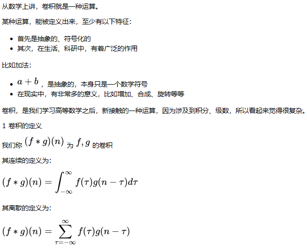    
[这篇文章通过举例来具体说明了这两个公式得到实际用途](https://www.cnblogs.com/sevenyuan/p/7810755.html)   
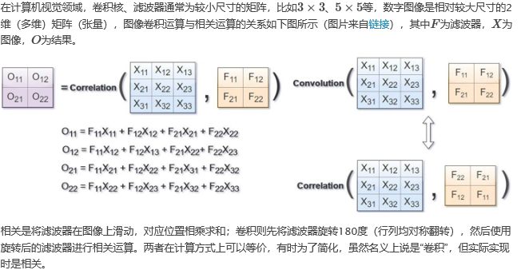   
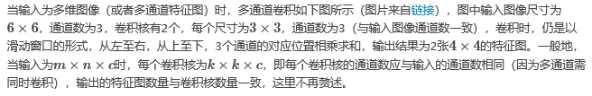   
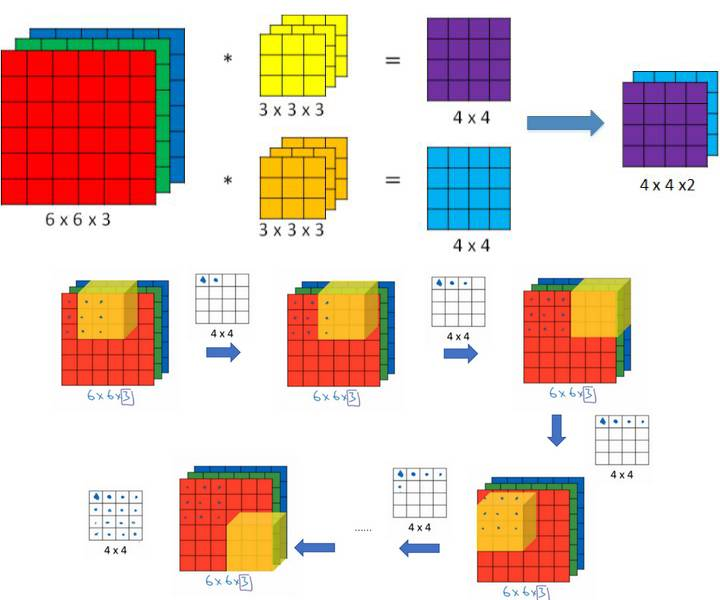   
[卷积神经网络之卷积计算、作用与思想 ](https://www.cnblogs.com/shine-lee/p/9932226.html)   
**理解卷积**   
这里提供两个理解卷积的角度：    
&emsp;&emsp;从函数（或者说映射、变换）的角度理解。 卷积过程是在图像每个位置进行线性变换映射成新值的过程，将卷积核看成权重，若拉成向量记为w
，图像对应位置的像素拉成向量记为x，则该位置卷积结果为y=w′x+b，即向量内积+偏置，将x变换为y。从这个角度看，**多层卷积是在进行逐层映射，整体构成一个复杂函数，训练过程是在学习每个局部映射所需的权重，训练过程可以看成是函数拟合的过程。**     

&emsp;&emsp;从模版匹配的角度理解。 前面我们已经知道，卷积与相关在计算上可以等价，相关运算常用模板匹配，即认为**卷积核定义了某种模式，卷积（相关）运算是在计算每个位置与该模式的相似程度，或者说每个位置具有该模式的分量有多少，当前位置与该模式越像，响应越强。**   
#### 动机  
&emsp;&emsp;卷积运算通过三个重要的思想来帮助改进机器学习系统：**稀疏交互**(sparse interactions)、**参数共享**(parameter sharing)、**等变表示**(equivariant representations)。   
* 稀疏交互：核的大小远小于输入。相对于全连接，一个输入项只影响较少神经元，大大减少运算量。  
* 参数共享：也叫绑定权重，每个核的权重不变，遍历整个输入。使我们只需要少量参数，   
* 等变表示：卷积网络具有平移等变的性质。  
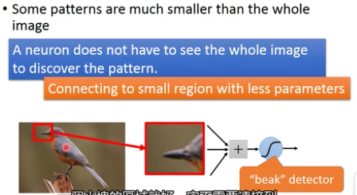     
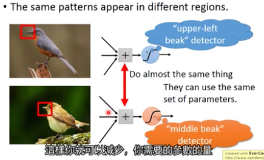     
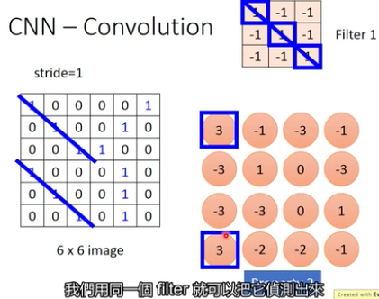     
它出现在左上跟左下角的位置，都可以用filter1来检测出来   
检测鸟嘴的位置，可以用一个fliter(固定的模式)来检测图中到底有没有鸟嘴，而不需要根据位置不同设计不同的patter      
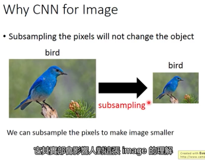   
更改图片的大小，上图中变为十分之一（通过去掉奇数列和偶数行），不会影响对图像的影响，同时可以扩大神经元的视野范围   
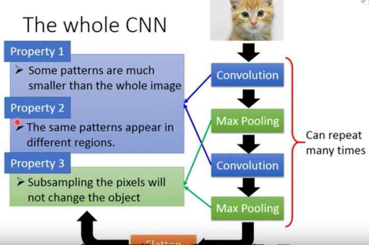   
>tf.nn.conv2d(input, filter, strides, padding, use_cudnn_on_gpu=True,  data_format='NHWC',dilations=[1, 1, 1, 1],name=None)    

* input： 指需要做卷积的输入图像，它要求是一个Tensor，具有[batch, in_height, in_width, in_channels]这样的shape，具体含义是[训练时一个batch的图片数量, 图片高度, 图片宽度, 图像通道数]，注意这是一个4维的Tensor，要求类型为float32和float64其中之一   
* filter： 相当于CNN中的卷积核，它要求是一个Tensor，具有[filter_height, filter_width, in_channels, out_channels]这样的shape，具体含义是[卷积核的高度，卷积核的宽度，图像通道数，卷积核个数]，要求类型与参数input相同，有一个地方需要注意，第三维in_channels，就是参数input的第四维     
* strides：卷积时在图像每一维的步长，这是一个一维的向量，长度4.  strides[0]=strides[3]=1   
* padding： string类型的量，只能是”SAME”,”VALID”其中之一，这个值决定了不同的卷积方式（后面会介绍）  
* use_cudnn_on_gpu： bool类型，是否使用cudnn加速，默认为true   
* dilation指的是空洞卷积，默认为1。关于空洞卷积可以查看知乎上大佬的https://www.zhihu.com/question/54149221/answer/192025860 我认为还是比较容易理解。   
--结果返回一个Tensor，这个输出，就是我们常说的feature map--
```
#步长不为1的情况，文档里说了对于图片，因为只有两维，通常strides取[1，stride，stride，1]

input = tf.Variable(tf.random_normal([1,5,5,5]))
filter = tf.Variable(tf.random_normal([3,3,5,7]))

op = tf.nn.conv2d(input, filter, strides=[1, 2, 2, 1], padding='SAME')1234

#此时，输出7张3×3的feature map 
```
[【TensorFlow】tf.nn.conv2d是怎样实现卷积的？](https://blog.csdn.net/mao_xiao_feng/article/details/78004522)   
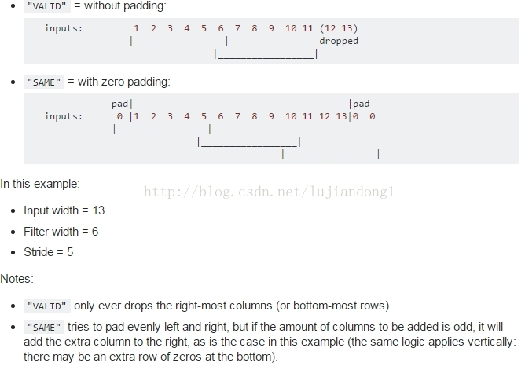   
&emsp;不同的padding方式,VALID是采用丢弃的方式,比如上述的input_width=13,只允许滑动2次,多余的元素全部丢掉     
&emsp;SAME的方式,采用的是补全的方式,对于上述的情况,允许滑动3次,但是需要补3个元素,左奇右偶,在左边补一个0,右边补2个0  

## 2. 反卷积(tf.nn.conv2d_transpose)    
首先无论你如何理解反卷积，请时刻记住一点，反卷积操作是卷积的反向,(转置卷积)   
>conv2d_transpose(value, filter, output_shape, strides, padding="SAME", data_format="NHWC", name=None)  
&emsp;&emsp;除去name参数用以指定该操作的name，与方法有关的一共六个参数：   
* 第一个参数value：指需要做反卷积的输入图像，它要求是一个Tensor   
* 第二个参数filter：卷积核，它要求是一个Tensor，具有[filter_height, filter_width, out_channels, in_channels]这样的shape，具体含义是[卷积核的高度，卷积核的宽度，卷积核个数，图像通道数]   
* 第三个参数output_shape：反卷积操作输出的shape，细心的同学会发现卷积操作是没有这个参数的，那这个参数在这里有什么用呢？下面会解释这个问题   
* 第四个参数strides：反卷积时在图像每一维的步长，这是一个一维的向量，长度4   
* 第五个参数padding：string类型的量，只能是"SAME","VALID"其中之一，这个值决定了不同的卷积方式   
* 第六个参数data_format：string类型的量，'NHWC'和'NCHW'其中之一，这是tensorflow新版本中新加的参数，它说明了value参数的数据格式。'NHWC'指tensorflow标准的数据格式[batch, height, width, in_channels]，'NCHW'指Theano的数据格式,[batch, in_channels，height, width]，当然默认值是'NHWC'   
  -----了解卷积的过程，参考另一篇文章：http://blog.csdn.net/mao_xiao_feng/article/details/53444333
[tf.nn.conv2d_transpose是怎样实现反卷积的？](https://blog.csdn.net/mao_xiao_feng/article/details/71713358)   
  
&emsp;&emsp;又一个很重要的部分！tf.nn.conv2d中的filter参数，是[filter_height, filter_width, in_channels, out_channels]的形式，而tf.nn.conv2d_transpose中的filter参数，是[filter_height, filter_width, out_channels，in_channels]的形式，注意in_channels和out_channels反过来了！因为两者互为反向，所以输入输出要调换位置   
```

import tensorflow as tf
x1 = tf.constant(1.0, shape=[1,3,3,1])
x2 = tf.constant(1.0, shape=[1,6,6,3])
x3 = tf.constant(1.0, shape=[1,5,5,3])

kernel = tf.constant(1.0, shape=[3,3,3,1])

y1 = tf.nn.conv2d_transpose(x1,kernel,output_shape=[1,6,6,3],
  strides=[1,2,2,1],padding="SAME")
  
y2 = tf.nn.conv2d(x3, kernel, strides=[1,2,2,1], padding="SAME")

y3 = tf.nn.conv2d_transpose(y2,kernel,output_shape=[1,5,5,3],
    strides=[1,2,2,1],padding="SAME")

y4 = tf.nn.conv2d(x2, kernel, strides=[1,2,2,1], padding="SAME")
'''
Wrong!!This is impossible
y5 = tf.nn.conv2d_transpose(x1,kernel,output_shape=[1,10,10,3],strides=[1,2,2,1],padding="SAME")
'''

sess = tf.Session()
tf.global_variables_initializer().run(session=sess)
x1_decov, x3_cov, y2_decov, x2_cov=sess.run([y1,y2,y3,y4])

print(x1_decov.shape)
print(x3_cov.shape)
print(y2_decov.shape)
print(x2_cov.shape)
```  
## 3. 池化运算的定义、种类（最大池化、平均池化等）、动机。    
池化层：对输入的特征图进行压缩，一方面使特征图变小，简化网络计算复杂度；一方面进行特征压缩，提取主要特征，如下：  
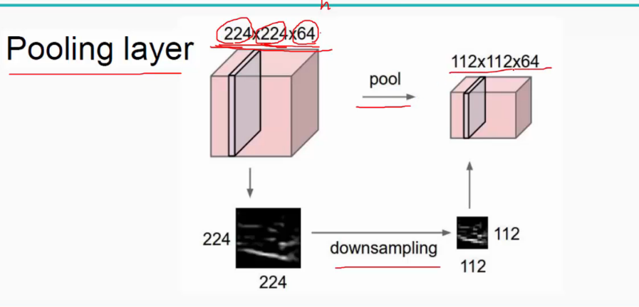  
池化操作一般有两种，一种是Avy Pooling,一种是max Pooling,如下：   
  
&emsp;&emsp;同样地采用一个2乘2 filter,max pooling是在每一个区域中寻找最大值，这里的stride=2,最终在原特征图中提取主要特征得到右图。    
&emsp;&emsp;（Avy pooling现在不怎么用了（其实就是平均池化层），方法是对每一个2乘2的区域元素求和，再除以4，得到主要特征），而一般的filter取2*2*,最大取3*3*,stride取2，压缩为原来的1/4.    
&emsp;&emsp;注意：这里的pooling操作是特征图缩小，有可能影响网络的准确度，因此可以通过增加特征图的深度来弥补（这里的深度变为原来的2倍）。    

*tf.nn.max_pool用法：*      

max pooling是CNN当中的最大值池化操作，其实用法和卷积很类似   
>tf.nn.max_pool(value, ksize, strides, padding, name=None)    
参数是四个，和卷积很类似：    
* value：需要池化的输入，一般池化层接在卷积层后面，所以输入通常是feature map，依然是[batch, height, width, channels]这样的shape   
* ksize：池化窗口的大小，取一个四维向量，一般是[1, height, width, 1]，因为我们不想在batch和channels上做池化，所以这两个维度设为了1    
* strides：和卷积类似，窗口在每一个维度上滑动的步长，一般也是[1, stride,stride, 1]   
* padding：和卷积类似，可以取’VALID’ 或者’SAME’   

返回一个Tensor，类型不变，shape仍然是[batch, height, width, channels]这种形式   
